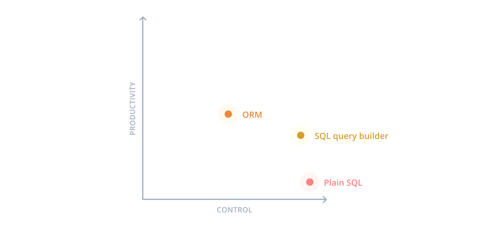

# Prisma

## Definition

Prisma is an ORM. An ORM, or Object-Relational Mapping, is a programming technique that allows developers to interact with a relational database using the object-oriented paradigm of their programming language, rather than writing raw SQL queries.

Prisma consists of the following parts:

1. Prisma Client:
   Auto-generated and type-safe query builder for Node.js & TypeScript
2. Prisma Migrate: Migration system
3. Prisma Studio: GUI to view and edit data in your database

## Prisma Client


## Prisma Schema

It all starts with Prisma Schema. It configures three things:

1. Data Source: Specifies your database connection
2. Generator: Indicates that you want to generate Prisma Client
3. Data Model: Defines your application models

### Data Source

### Generator

### Data Model

The data model has two main functions:

1. Represent a table in relational databases or a collection in non-relational databases
2. Provide the foundation for the queries in the Prisma Client API

We can generate a data model using two approaches:

1. Manually writing the model and mapping it to the database with Prisma Migrate
2. Generating the data model by introspecting a database

## Why Prisma?

Prisma ORM is designed to make working with databases easier and more efficient for developers

Some of the reasons:

1. Thinking in Objects Instead of Mapping Relational Data

   - Instead of thinking in terms of tables and rows (like in a database), you think in terms of objects and classes (like in your programming code)

2. Less Boilerplate

   - Prisma reduces the amount of repetitive code you need to write, so you can focus on the unique parts of your app

3. Auto-Completion in Code Editors
   - Prisma integrates with your code editor to provide suggestions as you type, so you don’t need to memorize everything or constantly look up documentation

### Comparison



## Data Modeling

The term data modeling refers to the process of defining the shape and structure of the objects in an application

When modeling data, you typically ask questions like:

1. What are the main entities/concepts in my application?
2. How do they relate to each other?
3. What are their main characteristics/properties?
4. How can they be represented with my technology stack?

### Data Modeling without Prisma

Data modeling typically needs to happen on (at least) two levels:

1. On the database level

   ```sql
   CREATE TABLE users (
     id AUTO_INCREMENT PRIMARY KEY NOT NULL,
     name VARCHAR(255),
     email VARCHAR(255) UNIQUE NOT NULL,
     isAdmin BOOLEAN NOT NULL DEFAULT false
   );
   ```

2. On the application level (i.e., in your programming language)
   ```javascript
   class User {
     constructor(user_id, name, email, isAdmin) {
       this.user_id = user_id;
       this.name = name;
       this.email = email;
       this.isAdmin = isAdmin;
     }
   }
   ```
   or if you use TypeScript
   ```typescript
   interface User {
     user_id: number;
     name: string;
     email: string;
     isAdmin: boolean;
   }
   ```

The way that models are represented on both levels might differ due to a few reasons:

1. Databases and programming languages use different data types
2. Relations are represented differently in a database than in a programming language
3. Databases typically have more powerful data modeling capabilities, like indexes, cascading deletes, or a variety of additional constraints (e.g. unique, not null, ...)
4. Databases and programming languages have different technical constraints

### Data Modeling with Prisma

With Prisma, you only need to define the models once. Either on the database or on the application levels

#### On The Database

**Using Prisma Client**. Application models are generated based on the introspection of your database schema

1. Change your database schema using SQL (e.g. CREATE TABLE, ALTER TABLE, ...)
2. Run prisma db pull to introspect the database and add application models to the Prisma schema
3. Run prisma generate to update your Prisma Client API

#### On The Application Levels

**Using Prisma Client and Prisma Migrate**. Data modeling happens in the Prisma schema by manually adding application models to it. Prisma Migrate maps these application models to tables in the underlying database

1. Manually change your application models in the Prisma schema (e.g. add a new model, remove an existing one, ...)
2. Run prisma migrate dev to create and apply a migration or run prisma db push to apply the changes directly (in both cases Prisma Client is automatically generated)

## REST with Prisma


### Example using Express.js

#### Prisma Schema

```javascript
datasource db {
  provider = "sqlite"
  url      = "file:./dev.db"
}

generator client {
  provider = "prisma-client-js"
}

model Post {
  id        Int     @id @default(autoincrement())
  title     String
  content   String?
  published Boolean @default(false)
  author    User?   @relation(fields: [authorId], references: [id])
  authorId  Int?
}

model User {
  id    Int     @id @default(autoincrement())
  email String  @unique
  name  String?
  posts Post[]
}
```

#### Get

```javascript
app.get("/feed", async (req, res) => {
  const posts = await prisma.post.findMany({
    where: { published: true },
    include: { author: true },
  });
  res.json(posts);
});
```

Full example at https://www.prisma.io/docs/orm/overview/prisma-in-your-stack/rest

## Get Started

```
mkdir prisma-project
cd prisma-project
```

```
npm init --y
npm install -D prisma typescript @types/express ts-node
```

```
npm install express @prisma/client
```

```
npx tsc --init
```

```
npx prisma
npx prisma init
```

```
npx prisma migrate dev --name init
```
